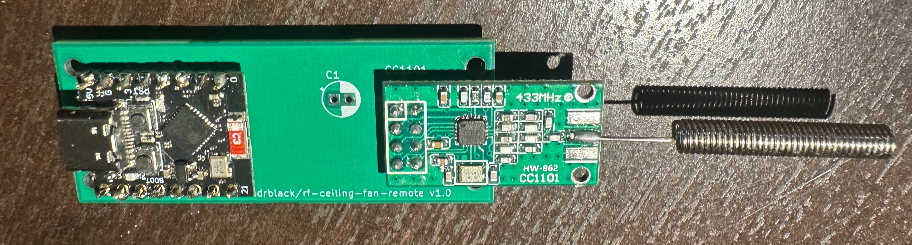

# rf-ceiling-fan-remote

Voice control for a combo ceiling fan + light, driven by directly cloning the RF remote's signal instead of physically pressing its buttons.

## Background

The original version of this project used a relay module wired across the buttons on the fan's remote control, triggered by an ESP32 listening on an Adafruit IO feed (fed via IFTTT/Google Assistant or iOS Shortcuts). It worked, but relays clicking against physical remote buttons is mechanically unreliable, and Google later removed the IFTTT conversational-actions feature that made flexible voice phrases possible.

This version replaces the relay entirely: a CC1101 RF transceiver connected directly to the ESP32 sniffs the remote's actual RF codes once, and then re-transmits them on command. Voice control goes through [SinricPro](https://sinric.pro), which exposes the fan and light as native devices in Google Home/Assistant (no relay, no fixed IFTTT phrases, natural voice commands like "set the fan to medium").

## Hardware

- ESP32-C3 Super Mini
- CC1101 RF transceiver module (433MHz-marketed hardware; this fan's remote actually operates at 304.25MHz, which the CC1101's synthesizer can still tune to directly)
- The fan's original remote control (used once, to sniff its codes)

## Wiring

| CC1101 pin | ESP32-C3 Super Mini pin |
|---|---|
| VCC | 3V3 (**3.3V only** — do not connect to 5V) |
| GND | GND |
| SCK | GPIO4 |
| MOSI | GPIO6 |
| MISO | GPIO5 |
| CS / SS | GPIO7 |
| GDO0 | GPIO3 |

A 100µF capacitor across the CC1101's VCC/GND pins (as close to the module as possible) was needed to get reliable SPI communication once the module started drawing the higher current TX requires — worth including if you build this yourself.

## Project structure

This is a multi-sketch PlatformIO project — each `.ino`/`.cpp` lives in its own subdirectory under `src/`, with a matching `[env]` in `platformio.ini` that filters the build to just that sketch:

| Environment | Source | Purpose |
|---|---|---|
| `c3_mini` (default) | `src/sniff.ino` | Listens on the CC1101 and prints the decimal code, bit length, protocol number, and pulse length for every button pressed on the physical remote. Run this first to capture your own remote's codes. |
| `c3_mini_tx` | `src/tx_test/` | Standalone transmit test — sends a single code on a timer, used for bench-testing range and signal timing independent of SinricPro/WiFi. |
| `c3_mini_fan` | `src/fan_control/` | The production firmware: connects to WiFi and SinricPro, and re-transmits the correct RF code when a fan or light command comes in. |
| `c3_mini_fan_public` | `src/fan_control_public/` | Same as `c3_mini_fan`, but for sharing with someone else who has the same fan/remote hardware — see [For other users](#for-other-users) below. |

Build/upload a specific environment with:
```
pio run -e c3_mini_fan -t upload
```

## This fan's captured RF codes

Captured with `sniff.ino` — protocol 11, 12-bit, ~412µs pulse length:

| Button | Decimal code |
|---|---|
| Fan low | 2044 |
| Fan medium | 3836 |
| Fan high | 3964 |
| Fan off | 4028 |
| Light toggle | 3068 |

If you're cloning this for a different remote, re-run `sniff.ino` and update the codes/protocol/pulse length in `src/fan_control/fan_control.cpp`.

## Setup

1. **Sniff your remote's codes** — flash `c3_mini`, open a serial monitor, and press each button once. Note the decimal code, protocol number, and pulse length for each.
2. **Create a SinricPro account** at [sinric.pro](https://sinric.pro) and add two devices:
   - A **Fan (US)** device — supports the 3-speed range this fan uses
   - A **Switch** device — for the light toggle
   (Free tier allows up to 3 devices.)
3. **Fill in credentials** — copy `src/fan_control/secrets.h.example` to `src/fan_control/secrets.h` (gitignored) and fill in your WiFi SSID/password, SinricPro App Key/Secret, and both device IDs.
4. **Flash the production firmware**: `pio run -e c3_mini_fan -t upload`
5. **Link SinricPro to Google Home** from the Google Home app (Works with Google / SinricPro integration) — the fan and light will show up as native devices, controllable by voice with no fixed phrase list.

## For other users

`c3_mini_fan` (above) compiles your WiFi and SinricPro credentials in from `secrets.h`, which is convenient for one device you control but means sharing it with someone else requires them to edit and rebuild the source. `c3_mini_fan_public` (`src/fan_control_public/`) is the same firmware — same CC1101 wiring, same RF codes/watchdogs/reliability behavior — but collects WiFi and SinricPro credentials at first boot through a [WiFiManager](https://github.com/tzapu/WiFiManager) captive portal instead, so someone with the **same fan/remote hardware** can flash it and configure it themselves without touching any code.

This only replaces the WiFi/SinricPro *credentials* — the RF codes, CC1101 pins, and RF frequency/protocol are still compile-time constants in the source, since those are specific to this exact fan/remote model. It's for sharing the same physical build, not a general-purpose RF-cloning tool.

Setup, for the person flashing it:

1. **Flash it**: `pio run -e c3_mini_fan_public -t upload` (no `secrets.h` needed for this target).
2. **Connect to the setup network** — on first boot (or whenever it can't connect to a previously saved WiFi network), it opens a WiFi access point named `FanControllerSetup`. Connect to it from a phone or laptop.
3. **Fill in the portal** — a captive portal page should open automatically (or navigate to `192.168.4.1`); choose your home WiFi network and enter its password, plus your own SinricPro App Key, App Secret, Fan device ID, and Light device ID (from your own SinricPro account — see [Setup](#setup) above for creating those devices), and optionally a device hostname (defaults to `myfan`, see below).
4. Submit — the device saves those to flash, connects to your WiFi, and starts talking to SinricPro. If it ever fails to connect (e.g. moved to a new network), it automatically reopens the `FanControllerSetup` portal.

Unlike `c3_mini_fan`, this build has no ntfy.sh push notifications — reboot reasons are still logged to serial for anyone debugging, just not pushed anywhere, to keep the shared build simpler and dependency-free for other users.

### Hostname, mDNS, and OTA updates

The device is reachable on the local network at `http://<hostname>.local` (default hostname `myfan`, changeable in the setup portal). This is used for:

- **OTA flashing during development**: `pio run -e c3_mini_fan_public -t upload --upload-port myfan.local` flashes over WiFi instead of USB.
- **Firmware updates without a cable, for anyone**: hold the **BOOT button** (GPIO9 on most ESP32-C3 boards) for 10 seconds to wipe the saved WiFi/SinricPro config and reboot into the `FanControllerSetup` portal — then, instead of (or in addition to) reconfiguring WiFi, use the portal's built-in **Update** page to upload a `.bin` firmware file directly from a browser. This is a stock WiFiManager feature, not custom code. Note the setup AP is open/unauthenticated by default, so this window is only as secure as who can join your WiFi during the brief time it's active.

### Multiple fan units

If you have more than one of these controllers on the same network (e.g. the remote's DIP switch supports multiple fans with different RF codes per unit), give each one a distinct hostname in the setup portal so they don't collide on the network — `myfan`, `myfan2`, etc.

## Known limitation

The remote only has a single **light toggle** button, not separate on/off codes. The firmware tracks an assumed light state locally and only fires the toggle when a voice command's requested state differs from that tracked state. If the light is ever toggled some other way (the original remote, a wall switch), the tracked state can drift out of sync with reality — there's no feedback path from the fan to detect this.

## Reliability

The production firmware (`fan_control.cpp`) includes a few self-healing measures for a device meant to run unattended indefinitely:

- **Bounded WiFi connect at boot** — if WiFi doesn't connect within 30s, it reboots and retries, instead of hanging forever.
- **WiFi watchdog** — if WiFi drops and stays disconnected for 60s during normal operation, it reboots.
- **SinricPro watchdog** — WiFi staying connected doesn't guarantee SinricPro's WebSocket/TLS connection is actually up. Tracks time since the last successful SinricPro connection independently of WiFi state, and reboots if it's been unreachable for 10 minutes — added after a field log showed WiFi stay associated for over an hour while SinricPro was unreachable (DNS/TLS failures), invisible to the WiFi watchdog, recovering only because SinricPro's own internal retry logic eventually got lucky.
- **Radio watchdog** — every 60s, re-checks that the CC1101 still answers over SPI (the same VERSION-register check done at boot). Catches the radio silently wedging mid-operation — a failure mode where WiFi/SinricPro stay connected (Google Assistant still gives its ack "beep") but the RF commands stop actually transmitting. Fixes itself with a reboot rather than needing a manual power cycle.
- **Daily scheduled reboot** — once a day at 3am (`REBOOT_HOUR`, US Eastern via the `TZ_STRING` POSIX timezone string, DST-aware), it reboots proactively to guard against slow heap fragmentation from the long-running SinricPro WebSocket/TLS connection. Time is synced via NTP at boot.
- **Unexpected reset detection** — a crash, a hung SSL/network stack triggering the hardware watchdog, a brownout, etc. bypass the above watchdogs entirely, since they reset the chip before any of our own code gets to run. On the next boot, `esp_reset_reason()` is checked against the reset that just happened; if it wasn't a normal power cycle/reset button press or one of our own deliberate `ESP.restart()` calls, it's reported the same way the other reboots are, instead of leaving an unexplained gap.

If you're deploying this outside US Eastern, update `TZ_STRING` in `fan_control.cpp` to your own [POSIX TZ string](https://developer.ibm.com/articles/au-aix-posix/).

### Reboot notifications

Since these self-healing reboots would otherwise happen silently, the reason for each one is written to flash (NVS) right before restarting, then read back and pushed as a [ntfy.sh](https://ntfy.sh) notification once WiFi reconnects on the next boot — so a device that's rebooting every 10 minutes shows up as a stream of pushes on your phone instead of going unnoticed. A normal manual power cycle leaves no reason behind, so it stays quiet.

To enable it: pick a random, unguessable topic name (ntfy topics are unauthenticated — anyone who knows the exact name can read the notifications), set it as `NTFY_TOPIC` in `secrets.h`, and subscribe to that same topic in the [ntfy app](https://ntfy.sh/app) (iOS/Android) or web app.
